# ✅ Error Handling Workflow — Clean Architecture Friendly

---

## 🎯 Goal
Establish a **unified, robust, and scalable** error handling strategy tailored for Flutter applications,
that adheres to **Clean Architecture** and embraces **SOLID principles**.

---


## ⚙️ System Overview

This error handling workflow strictly follows **Clean Architecture** and is optimized for **production-grade Flutter apps**:


### ✅ Data Layer

Implements a **hybrid strategy** combining two mechanisms:

* **ASTRODES** (API/System Throwable Response → Domain Error Strategy):
  - External/system/SDK errors (e.g. `DioError`, `FirebaseException`, `PlatformException`, `SocketException`, etc.) are **thrown**
  - These are caught and mapped in the repository

* **Either** (App-Zone Expected Result):
  - Anticipated logical outcomes (e.g. cache miss, duplicate, validation error) are returned as `Either<Failure, T>` without throwing

> This approach ensures traceability for unexpected exceptions while cleanly separating known domain errors.

---


### ✅ Repository Layer

Serves as the **central error boundary**, converting all outcomes to the unified Either format. Inherits from `BaseRepository`.

* For thrown exceptions (ASTRODES):
  - Catches errors
  - Maps to domain-level `Failure` using `FailureMapper`
  - Returns as `Left(Failure)` via Either

* For expected failures (Either-style):
  - Forwards the `Either<Failure, T>` result directly, returns them **as-is**

> Every public method returns a standardized shape:  
> `ResultFuture<T> = Future<Either<Failure, T>>`

Examples:
```dart
Future<Either<Failure, T>> safeCall<T>(Future<T> Function() action) async {
  try {
    final result = await action();
    return Right(result);
  } catch (error, stack) {
    return Left(FailureMapper.from(error, stack));
  }
}

Future<Either<Failure, void>> safeCallVoid(Future<void> Function() action) async {
  try {
    await action();
    return const Right(null);
  } catch (error, stack) {
    return Left(FailureMapper.from(error, stack));
  }
}


### ✅ Domain Layer (UseCase)

Inherits from `UseCaseWithParams` or `UseCaseWithoutParams`.
Implements **pure business logic**, delegates to repositories.

* Always returns: `ResultFuture<T> = Future<Either<Failure, T>>`
* Can use `.flatMap()` or `.mapRight()` for additional logic
* No platform or framework dependencies
* Delegates logic


### ✅ Cubit / Notifier Layer

Responsible for **handling results and emitting states**.

* **Simple cases** use classical:

  ```dart
  result.fold(
    (f) => emit(ErrorState(f)),
    (v) => emit(SuccessState(v)),
  );
  ```

* **Complex flows** use:

  ```dart
  await getUserUseCase().then(
    (r) => DSLLikeResultHandler(r)
      ..onFailure((f) => emit(ErrorState(f)))
      ..onSuccess((v) => emit(SuccessState(v)))
      ..log(),
  );
  ```

> DSL-like syntax is more readable for flows with multiple chained steps, recover, or fallback logic.
> Use DSL **when**: 
  - you need `.log()`, `.track()`, `.redirect()`, etc.
  - UX feedback is composite (reset form, delay, retry)


### ✅ Presentation Layer (UI)

Does not access raw `Failure`.

* Listens for `state.failure` which is:
  * A `Consumable<FailureUIModel>`
  * Mapped from `Failure` via `.toUIModel()`

* Visual feedback is delegated to `OverlayDispatcher`:
  ```dart
  final model = state.failure?.consume();
  if (model != null) context.showError(model);
  ```

> This keeps UI layer stateless, reactive, testable, and internationalized.


### 🧩 What is `Consumable<T>`?

`Consumable<T>` is a one-time value wrapper for safe UI feedback triggers.
**Advantages:**
* Guarantees one-shot side effects
* Prevents duplicate feedback on rebuilds
* Declarative and testable

---


### 🔄 Full Flow Diagram

```mermaid
sequenceDiagram
    participant UI
    participant Cubit
    participant UseCase
    participant Repo
    participant DataSource

    UI->>Cubit: trigger action
    Cubit->>UseCase: call use case
    UseCase->>Repo: request data
    Repo->>DataSource: fetch/compute result
    DataSource-->>Repo: Either (Either) or throw (ASTRODES)
    Repo->>Repo: catch + map → `FailureMapper`
    Repo-->>UseCase: Left(Failure) or Right(Data)
    UseCase-->>Cubit: propagate result (Either)
    Cubit-->>UI: emit state + `FailureUIModel`
    UI->>UI: show overlay if `.consume()` is not null
```



---


### ✅ Summary

#### 🧱 Layered Responsibilities

| Layer / Component     | Role                                     | Best Practice                                                                    |
| --------------------- | ---------------------------------------- | -------------------------------------------------------------------------------- |
| **DataSource**        | Accesses raw data (SDK, API, platform)   | Hybrid approach: `throw` for ASTRODES, return `Either<Failure, T>` for Either      |
| **Repository**        | Converts outcomes to Either format         | Wraps calls via `safeCall` / `safeCallVoid`, uses `FailureMapper` for exceptions |
| **FailureMapper**     | Converts exceptions into domain failures | Central mapping layer; supports Crashlytics, debug logging                       |
| **UseCase**           | Delegates logic and returns result       | Standard: `ResultFuture<T>` = `Future<Either<Failure, T>>`; pure, framework-free |
| **Cubit / Notifier**  | Handles result and emits state           | Uses `.fold()` for simple flows, DSL handler for UX feedback & chaining          |
| **UI Layer**          | Displays feedback based on state         | Observes `Consumable<FailureUIModel>`, triggers overlay if `.consume() != null`  |
| **OverlayDispatcher** | Renders visual feedback centrally        | Uses `context.showError(...)` with `FailureUIModel`                      |

---

#### 🧩 Core Error Handling Concepts

| Concept             | Purpose                                                       |
| ------------------- | ------------------------------------------------------------- |
| `Failure`           | Domain-level abstraction of error                             |
| `FailureUIModel`    | Visual + localized error model used by UI                     |
| `Consumable<T>`     | Ensures feedback triggers only once                           |
| `OverlayDispatcher` | Layer-agnostic error delivery for dialogs/snackbars/banners   |
| `translationKey`    | i18n key for `FailureUIModel`; enables full localization path |
| `FailureMapper`     | Converts caught ASTRODES exceptions to structured Failure type|


---

#### 🧭 Decision Matrix

| Context                     | Preferred Strategy                 | Rationale                                                          |
| --------------------------- | ---------------------------------- | ------------------------------------------------------------------ |
| Complex UX flows            | ✅ `DSLLikeResultHandler`           | Fluent control for logs, side effects, fallback, or retry chains   |
| Basic success/failure logic | ✅ `.fold()` / `.match()`           | Simple, concise, readable                                          |
| SDK/API/Platform errors     | ✅ ASTRODES                         | Thrown, then caught in repo and mapped via `FailureMapper`         |
| Known domain failures       | ✅ Either                             | Returned as `Either<Failure, T>` without throwing                  |
| Result shape                | ✅ `ResultFuture<T>` everywhere     | Standardized async result format in all layers                     |
| Exception handling          | ✅ `safeCall()` or `safeCallVoid()` | Captures and maps low-level errors to Either                         |
| Failure-to-UI mapping       | ✅ `.toUIModel()`                   | Produces consistent UI-ready error with icon & translation support |
| UI delivery trigger         | ✅ `context.showError(...)` | Unified mechanism for showing user-facing errors                   |
| Feedback one-time handling  | ✅ `Consumable<FailureUIModel>`     | Ensures overlays shown once per failure emission                   |

---

#### ✅ Key Benefits

* 📐 Enforces Clean Architecture across all layers
* 🔁 Supports both `.fold()` and DSL-like handler styles
* 🔍 Typed results (`Either<Failure, T>`) at every transition point
* 🔧 `FailureMapper` gives central, customizable error conversions
* 🧪 Easily testable: no untyped exceptions leaked to upper layers
* 🚀 Overlay-based UI feedback: clean, testable, localizable
* 🌍 Fully i18n-capable with `translationKey` support
* 🧩 Modular extension: `.log()`, `.retry()`, `.track()`, `.redirect()`
* 🔐 Ready for Crashlytics / analytics
* 🧼 Feedback flow guarantees one-shot UX via `Consumable`
