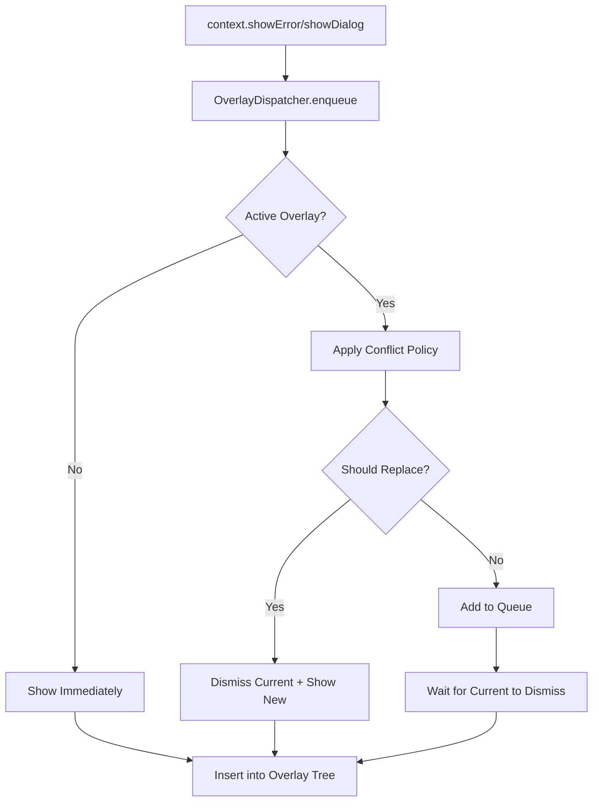

# 🎪 Overlays Module Guide

_Last updated: 2025-08-08_

[](https://flutter.dev/)
[](https://dart.dev/)

---

## 🎯 OVERVIEW

---

This module provides a **platform-adaptive, type-safe overlay system** for Flutter apps with Clean Architecture.
It handles dialogs, banners, snackbars, and error feedback in a **declarative**, **conflict-aware** manner
that works seamlessly with **Riverpod**, **Cubit**, and **BLoC**.

🦾 **Key Benefits:**

- 🤖 **Platform-adaptive:** iOS/Android native look & feel with unified behavior
- ⚡ **Conflict resolution:** Smart queuing, priority-based replacement
- 🎨 **Fully customizable:** Presets, animations, themes
- 🔄 **State-agnostic:** Works seamlessly with any state management
- 🎭 **Animation engine:** Smooth, configurable transitions
- 📱 **Responsive:** Adapts to screen sizes and safe areas
- ⚡ **Developer Experience:** Simple API with powerful customization
- 🔒 **Type Safety:** Compile-time guarantees for overlay configuration
- 🧹 **Auto Lifecycle:** Smart cleanup prevents memory leaks
- 🧹 **Auto-cleanup:** Dismisses overlays on navigation

### **Design Philosophy**

- **Declarative over imperative:** Use context extensions instead of manual widget creation
- **Platform-aware by default:** Automatically adapts to iOS/Android conventions
- **Conflict resolution built-in:** Smart queuing prevents overlay chaos
- **Performance first:** Minimal overhead with maximum functionality
- **Clean architecture:** Separate concerns between presentation, logic, and styling
- **Single Responsibility**: Each overlay entry handles only its UI + strategy
- **Encapsulation**: Overlay logic lives in its own entries
- **Open/Closed**: Add new overlay types without touching Dispatcher logic
- **Dependency Inversion**: Dispatcher accessed via `context.dispatcher` (DI)

---

## 🚀 Quick Start

---

### Basic Usage

```dart
// Error handling
context.showError(failureUIEntity, showAs: ShowAs.dialog);

// Success feedback
context.showUserBanner(
  message: "Profile updated!",
  preset: const OverlaySuccessUIPreset(),  // optional parameter
);

// User confirmations
context.showUserDialog(
  title: "Delete Item",
  content: "Are you sure?",
  onConfirm: () => deleteItem(),
);
```

### Integration with State Management

#### With Riverpod:

```dart
@riverpod
Future<User> userProfile(UserProfileRef ref, String userId) async {
  final result = await getUserUseCase(userId);
  return result.fold(
    (failure) => throw failure,
    (user) => user,
  );
}

// In Widget
@override
Widget build(BuildContext context, WidgetRef ref) {
  final userAsync = ref.watch(userProfileProvider(userId));

  // 🎯 Auto-show errors as overlays
  ref.listenFailure(userProfileProvider(userId), context);

  return userAsync.when(
    loading: () => const CircularProgressIndicator(),
    data: (user) => UserProfileView(user: user),
    error: (_, __) => const SizedBox.shrink(), // Error handled by overlay
  );
}
```

#### With Cubit/BLoC:

```dart
// In Cubit
Future<void> updateProfile(UserData data) async {
  emit(UserUpdating());
  final result = await updateUserUseCase(data);
  result.fold(
    (failure) => emit(UserError(failure.asConsumable())),
    (user) => emit(UserUpdated(user)),
  );
}

// In Widget
BlocListener<UserCubit, UserState>(
  listener: (context, state) {
    final failure = state.failure?.consume();
    if (failure != null) {
      context.showError(failure.toUIEntity());
    }
  },
  child: BlocBuilder<UserCubit, UserState>(
    builder: (context, state) => switch (state) {
      UserUpdating() => const LoadingView(),
      UserUpdated(:final user) => UserProfileView(user),
      UserError() => const SizedBox(), // Error handled by listener
    },
  ),
)
```

---

## 📝 API Reference

---

### ✅ High-Level API (context extension)

These methods wrap low-level `OverlayBaseMethods` with default priority, preset, and strategy.

```dart
context.showError(...);
context.showUserDialog(...);
context.showUserBanner(...);
context.showUserSnackbar(...);
```

### Low-Level Methods

```dart
// Direct overlay methods
context.showAppDialog(...)
context.showBanner(...)
context.showSnackbar(...)

// Dispatcher access
context.dispatcher.enqueueRequest(context, overlayEntry)
context.dispatcher.dismissCurrent(force: true, clearQueue: false)
```

---

## 🧩 Architecture & Core Concepts

---

### Key Components

| Component                         | Purpose                                                     |
| --------------------------------- | ----------------------------------------------------------- |
| `ContextXForOverlays`             | Main API: `context.showError()`, `context.showUserDialog()` |
| `OverlayBaseMethods`              | Low-level base extension that builds actual UI entries      |
| `OverlayDispatcher`               | Queue management, conflict resolution, lifecycle            |
| `OverlayUIEntry`                  | abstract descriptor of a queued overlay                     |
| `OverlayUIPresets`                | Styling presets (Error, Success, Warning, etc.)             |
| `PlatformMapper`                  | Resolves iOS/Android specific widgets                       |
| `AnimationEngine`                 | Handles overlay entrance/exit animations                    |
| `GlobalOverlayHandler`            | Gesture handler to dismiss overlays and keyboard            |
| `OverlaysCleanerWithinNavigation` | Resets overlays on navigation events                        |

### 🧠 Overlay Dispatcher Logic

- Holds **queue** of `OverlayQueueItem`
- Checks if overlay is active
- Applies conflict **replacement or wait policy**
- Controls animation dismissal callbacks
- Applies debounce per `OverlayCategory`

  ### Priority System

```dart
enum OverlayPriority {
  userDriven,  // 🫱 User-initiated, can wait in queue
  normal,      // ⚡ Standard priority
  high,        // 🔥 Important, replaces lower priority
  critical     // 🚨 Always shown immediately
}
```

### Conflict Resolution

| Policy                 | Behavior                             |
| ---------------------- | ------------------------------------ |
| `waitQueue`            | Wait for current overlay to finish   |
| `forceReplace`         | Always replace current overlay       |
| `forceIfSameCategory`  | Replace if same type (dialog/banner) |
| `forceIfLowerPriority` | Replace if new has higher priority   |
| `dropIfSameType`       | Ignore duplicate overlay types       |

### Manual Control

```dart
final dispatcher = context.dispatcher;
// Check dismissibility
if (dispatcher.canBeDismissedExternally) {
  await dispatcher.dismissCurrent();
}
// Clear all pending
dispatcher.clearAll();
```

### Global Overlays Handling integration

Attached in `AppMaterialAppRouter.builder`. On global tap:

- Hides keyboard
- Dismisses overlay if `OverlayDismissPolicy.dismissible`

```dart
 MaterialApp.router(
      ...
      // 🧩 Overlay system
      builder: (context, child) => GlobalOverlayHandler(child: child!),
    );
  }
}
```

### 🎛️ Tap-Through Mechanism

Overlays support **tap-through UX** by default for banners/snackbars:

```dart
TapThroughOverlayBarrier(
  enablePassthrough: true,
  onTapOverlay: () => dismissIfAllowed(),
  child: bannerWidget,
)
```

This allows user to **interact with widgets underneath** overlay (e.g., click a button behind banner).

### 🛰️ Navigation-Aware Overlays

- `OverlayNavigatorObserver` listens to route changes
- Auto-clears overlays via `dispatcher.clearAll()`
- Prevents stale overlays after navigation

  ### 📡 State Exposure

  Use these to disable buttons / prevent unwanted inputs when overlays are active.

  - 1. **Reactive**

```dart
context.watch<OverlayStatusCubit>().state; // true if active
```

- 2. **Non-Reactive**

```dart
context.overlayStatus; // fast, cached read (extension)
```

### Overlay Flow



### 📦 Overlay Entry Lifecycle

- 1. **Engine** (animations)

* Chosen via `getEngine(OverlayCategory)`
* Injected into platform widget

  - 2. **Widget** (platform-aware)

* Built by `PlatformMapper`
* Uses `Fade/Scale/SlideTransition`
* Animated by injected `AnimationEngine`

  - 3. **Wrapper**

* Wrapped in `AnimatedOverlayWrapper`
* Controls entrance/exit lifecycle
* Accepts `displayDuration`

  - 4. **Entry**

* Instantiated as `OverlayUIEntry` (e.g., `SnackbarOverlayEntry`)
* Includes: `priority`, `policy`, `dismissPolicy`, `tapPassthrough`

  - 5. **Queue + Dispatcher**

* Sent to `OverlayDispatcher.enqueueRequest(...)`
* Strategy resolved via `OverlayPolicyResolver`
* Inserted into overlay with `OverlayEntry`
* Barrier is added via `TapThroughOverlayBarrier`

---

## 🎨 Customization

---

### Built-in Presets

```dart
// Error styling - Red with error icon
const OverlayErrorUIPreset()

// Success styling - Green with check icon
const OverlaySuccessUIPreset()

// Warning styling - Orange with warning icon
const OverlayWarningUIPreset()

// Info styling - Blue with info icon (default)
const OverlayInfoUIPreset()

// Confirmation styling - Teal for dialogs
const OverlayConfirmUIPreset()
```

### Custom Presets

```dart
// Override specific properties
final customPreset = const OverlayInfoUIPreset().withOverride(
  color: Colors.purple,
  icon: Icons.star,
  duration: const Duration(seconds: 5),
  shape: RoundedRectangleBorder(
    borderRadius: BorderRadius.circular(16),
  ),
);

context.showUserBanner(
  message: "Custom styled banner",
  preset: customPreset,
);
```

### Custom Animations

The module integrates with an animation engine that provides:

- Fade + Scale transitions
- Slide transitions (top/bottom)
- Platform-specific curves
- Configurable durations

---

## 📦 File Structure

---

```
overlays/
├── core/
│   ├── _context_x_for_overlays.dart             # Main context extensions
│   ├── _overlay_base_methods.dart               # Low-level overlay methods
│   ├── enums_for_overlay_module.dart            # Priority, policies, categories
│   ├── global_overlay_handler.dart              # Screen-wide tap handling
│   ├── platform_mapper.dart                    # Platform-specific widget resolver
│   └── tap_through_overlay_barrier.dart        # Tap-through behavior
│
├── overlays_dispatcher/
│   ├── _overlay_dispatcher.dart                 # Main dispatcher logic
│   ├── overlay_dispatcher_provider.dart        # Riverpod provider
│   ├── overlay_entries/
│   │   ├── _overlay_entries_registry.dart       # Entry types registry
│   │   ├── banner_overlay_entry.dart           # Banner entry implementation
│   │   ├── dialog_overlay_entry.dart           # Dialog entry implementation
│   │   └── snackbar_overlay_entry.dart         # Snackbar entry implementation
│   ├── overlay_logger.dart                     # Debug logging
│   └── policy_resolver.dart                    # Conflict resolution logic
│
├── overlays_presentation/
│   ├── overlay_presets/
│   │   ├── overlay_presets.dart                # Styling presets
│   │   └── overlay_preset_props.dart           # Props data class
│   ├── overlay_utils.dart                      # Utility functions
│   └── widgets/
│       ├── android/
│       │   ├── android_banner.dart             # Material banner
│       │   ├── android_dialog.dart             # Material dialog
│       │   └── android_snackbar.dart           # Material snackbar
│       └── ios/
│           ├── ios_banner.dart                 # Cupertino banner
│           ├── ios_dialog.dart                 # Cupertino dialog
│           └── ios_snackbar.dart               # Cupertino toast
│
└── Overlays_module_README.md                   # This documentation
```

---

## ❓ FAQ

---

**Q: How do I customize the appearance of overlays?**
A: Use the built-in presets or create custom ones with `.withOverride()`. You can customize colors, shapes, icons, padding, and duration.

**Q: Can overlays be shown from background tasks?**
A: Overlays require a BuildContext, so they should only be triggered from UI code or state management that has context access.

**Q: How do I prevent overlay duplication?**
A: The system automatically handles duplicates based on conflict policies. Use `OverlayReplacePolicy.dropIfSameType` to prevent duplicates entirely.

**Q: Can I show multiple overlays at once?**
A: No, only one overlay is visible at a time. Additional overlays either replace the current one or wait in a queue based on priority and policy.

**Q: How do I handle overlays in tests?**
A: Mock the OverlayDispatcher or use widget tests with `pumpAndSettle()` to verify overlay appearance.

**Q: Do overlays work with form validation?**
A: Yes, use `context.showError()` to display validation failures as banners or snackbars.

**Q: How do I make overlays dismiss automatically?**
A: Set `autoDismissDuration` in the preset or individual overlay methods. Use `Duration.zero` for persistent overlays.

**Q: Can I customize animations?**
A: Yes, the module integrates with an animation engine that allows custom transitions, durations, and curves.

---

## 🛠 Troubleshooting

---

**Overlay not showing:**

- Ensure context is mounted: `if (context.mounted) context.showError(...)`
- Check if another overlay is blocking (use higher priority)
- Verify preset configuration is valid

**Overlay appears but looks wrong:**

- Check platform-specific styling in theme
- Ensure preset properties are correctly configured
- Verify safe area constraints are respected

**Animation glitches:**

- Update to latest Flutter version
- Check for conflicting animation libraries
- Verify overlay is not being rebuilt during animation

**Memory leaks:**

- Overlays auto-dispose when dismissed
- Use `context.dispatcher.clearAll()` when needed
- Avoid storing strong references to overlay entries

---

## 💡 Best Practices

---

### ✅ Do

- **Use presets consistently:** Stick to built-in presets for visual consistency
- **Handle errors declaratively:** Use `context.showError()` for all error feedback
- **Leverage auto-dismiss:** Set appropriate durations for non-critical overlays
- **Test overlay flows:** Write tests for error handling and user interactions
- **Use priority system:** Set appropriate priority levels for different overlay types
- **Wrap apps with GlobalOverlayHandler:** Enable automatic keyboard/overlay dismissal

### ❌ Don't

- **Mix overlay libraries:** Don't use other toast/dialog libraries alongside this module
- **Show overlays from initState:** Always show overlays after build completes
- **Ignore conflict policies:** Don't assume overlays will always show immediately
- **Hardcode styling:** Always use presets instead of inline styling
- **Block UI unnecessarily:** Use `isDismissible: true` unless truly critical
- **Forget context availability:** Only show overlays when context is mounted

### 🎯 Patterns

```dart
// ✅ Good: Declarative error handling
result.fold(
  (failure) => context.showError(failure.toUIEntity()),
  (success) => context.showUserBanner(message: "Success!"),
);

// ❌ Bad: Imperative dialog handling
if (error != null) {
  showDialog(
    context: context,
    builder: (_) => AlertDialog(/* manual setup */),
  );
}

// ✅ Good: Consistent styling
context.showUserSnackbar(
  message: "Saved",
  preset: const OverlaySuccessUIPreset(),
);

// ❌ Bad: Inconsistent styling
ScaffoldMessenger.of(context).showSnackBar(
  SnackBar(/* manual styling */),
);
```

## ⚡ Performance Notes

- Overlays use Flutter's Overlay widget for optimal performance
- Animation engines are optimized for 60fps rendering
- Only one overlay renders at a time, minimizing resource usage
- Platform-specific widgets reduce unnecessary abstraction overhead
- Presets are memoized to prevent repeated style calculations

---

    📕 TO DO:
    1.	Гарантований dismiss у діалогах (обгортка: спочатку dismiss, потім callback).
    2.	Semantic deduplication key в OverlayUIEntry + використання у showBanner/snackbar/dialog.
    3.	Non-null dismissPolicy для всіх entries.
    4.	Fail-safe у _tryProcessQueue (catch і reset стану).
    5.	A11y & haptics: live regions для повідомлень, focus trap у діалозі, легкі тактильні сигнали для high/critical.
    6.	Єдність локалізації (AppLocalizer у всіх дефолтах).

---

## 🏆 Final Notes

---

This overlay system provides:

- **Consistent UX** across platforms
- **Declarative API** for clean code
- **Smart conflict resolution**
- **Easy customization** with presets
- **Seamless state management** integration

> **Build delightful user experiences with professional overlay management!** 🎪✨  
> This module handles all the complexity so you can focus on your app's unique features.

**Happy coding!** 🚀

---

---
