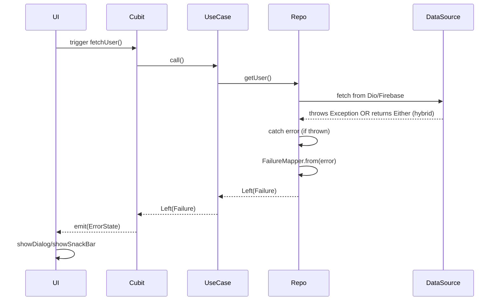

# ✅ Error Handling Workflow — Clean Architecture Friendly

---

## 🎯 Goal

Design a **unified, robust, and scalable** error handling system for Flutter apps using **Clean Architecture + SOLID principles**.

---

## ⚙️ System Overview

This workflow strictly follows Clean Architecture:

* **Data Layer:** hybrid — throws exceptions (`ASTRODES`) for SDK/API, but returns `Either<Failure, T>` directly (`AZER`) for expected issues (validation, cache, known states)
* **Repository Layer:** catches exceptions (from ASTRODES) and converts them to `Failure`; passes AZER as-is
* **Domain Layer:** uses `Either<Failure, T>` or `DSLLikeResultHandler` to propagate results
* **Cubit/Notifier Layer:** handles result and emits state (via `.fold()` or DSL)
* **UI Layer:** responds to `Failure` (e.g. shows SnackBar or Dialog)

> **Bonus:** Fully extensible, testable, debuggable, and production-ready with Firebase Crashlytics or logs.

---

## 🧱 Architecture Placement

| Layer          | Responsibility                                                    |
| -------------- | ----------------------------------------------------------------- |
| DataSource     | Uses hybrid: throws (ASTRODES) for SDK/API, returns Either (AZER) |
| Repository     | Catches errors, maps to `Failure` via `FailureMapper`             |
| UseCase        | Delegates logic, forwards `Either<Failure, T>`                    |
| Cubit/Notifier | Triggers states from result                                       |
| UI             | Reacts to state changes with visuals (e.g. SnackBar)              |

where:

* ASTRODES = API/System Throwable Response → Domain Error Strategy
* AZER = App-Zone Expected Result

---

## 🔄 Full Flow



---

## 📦 Folder Responsibilities

### 1. **DataSource (Data Layer)**

* May throw (ASTRODES): `SocketException`, `HttpException`, `TimeoutException`, etc.
* Or return `Either<Failure, T>` directly (AZER) for:

  * Cache misses
  * Domain validation errors
  * Known failure conditions

```dart
// AZER-style — no throw, returns Either for known state
ResultFuture<UserDTO> getUser() async {
  if (!cache.contains(uid)) {
    return Left(CacheFailure(...));
  }
  return Right(cache.get(uid));
}

// ASTRODES-style — throw if SDK/API fails
Future<UserDTO> getUserFromApi() async {
  final response = await dio.get(...); // throws if fails
  return UserDTO.fromJson(response.data);
}
```

---

### 2. **Repository (Data Layer)**

* Inherits from `BaseRepository`
* Uses `safeCall` / `safeCallVoid` for all async operations
* Maps exceptions via `FailureMapper`

```dart
class UserRepositoryImpl extends BaseRepository implements UserRepository {
  @override
  Future<Either<Failure, User>> getUser() async {
    return safeCall(() async {
      final dto = await remoteDataSource.getUserFromApi();
      return dto.toEntity();
    });
  }
}
```

---

### 3. **UseCase (Domain Layer)**

* Inherits from `UseCaseWithParams` or `UseCaseWithoutParams`
* Delegates logic to repository

```dart
class GetUserUseCase extends UseCaseWithoutParams<User> {
  final UserRepository _repo;
  const GetUserUseCase(this._repo);

  @override
  ResultFuture<User> call() => _repo.getUser();
}
```

---

### 4. **Cubit/Notifier (Presentation/Orchestration)**

* Option A: Classical `.fold()` approach
* Option B: DSL-like syntax via `DSLLikeResultHandler`

```dart
// Classic AZER
final result = await getUserUseCase();
result.fold(
  (f) => emit(UserError(f)),
  (u) => emit(UserLoaded(u)),
);

// DSL-like with ResultHandler
await getUserUseCase()
  .then((r) => DSLLikeResultHandler(r)
    .onFailure((f) => emit(UserError(f)))
    .onSuccess((u) => emit(UserLoaded(u))));
```

---

### 5. **UI (Presentation)**

UI listens to `ErrorState` and invokes a centralized visual handler using `FailureNotifier` + `Consumable<Failure>`.

```dart
BlocListener<UserCubit, UserState>(
  listenWhen: (prev, curr) =>
      prev.status != curr.status && curr.status == UserStatus.error,
  listener: (context, state) {
    FailureNotifier.handle(context, state.failure);
    context.read<UserCubit>().clearFailure();
  },
  child: UserView(),
);
```

---

## 📌 `FailureNotifier` — Central UI Error Handler

* Ensures UI error is shown **only once** (dialog/snackbar)
* Uses `consume()` method from `Consumable`
* Optional `handleAndReset()` resets Bloc/form state after feedback

---

## 🧩 What is `Consumable<T>`?

`Consumable<T>` is a one-time value wrapper for safe UI feedback triggers.

**Advantages:**

* Guarantees one-shot side effects
* Prevents duplicate feedback on rebuilds
* Declarative and testable

---

## ✅ Summary

| Responsibility | Best Practice                     |
| -------------- | --------------------------------- |
| DataSource     | hybrid: throws or returns Either  |
| Repository     | extends BaseRepository + safeCall |
| UseCase        | abstract base, returns Either     |
| Cubit          | fold() or DSLHandler + emit()     |
| UI             | `FailureNotifier` + `Consumable`  |
| FailureMapper  | central mapping + logging         |

---

## ✅ Benefits

* Clean separation of concerns
* Two alternative handling paths: explicit & DSL-like
* Centralized `FailureMapper`
* Safe feedback with `Consumable`
* Ready for internationalization, Crashlytics, retry
* Consistent with Clean Architecture principles

---


